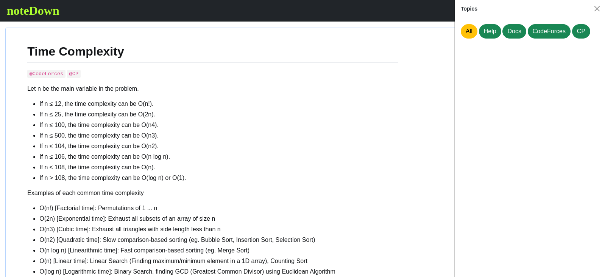

# noteDown 

____
+ **noteDown** , as the name suggests noteDown is the one kind of note-taking app. that uses Markdown to format the text or style the note of your choice. 
+ This app requires you to authenticate yourself using your GitHub Account login & password.
+ We are using GitHub APIs to create a private repository in your account, which will store your notes in your Repository.
+ We respect your privacy. That's why we are not storing your personal information in our Databases.
+ noteDown is the openSource note-taking app that provides a fully customized and secure environment
+ [Visit our officail websitte :leftwards_arrow_with_hook:](https://mudassirgig.pythonanywhere.com/home)
____
**Note :**  Please Select All Repositories While Installing The App.
